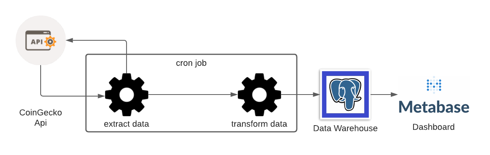

# yld-token-cap

This is a project that sends token information from Coingecko to a postgres instance hosted on AWS ec2. 


## Architecture



Pipeline: Python

Database: Postgres

Dashboard: Metabase

The pipeline is scheduled using crontab. 

## Setup 

Python is used to pull, transform, and load data. The Database is Postgres. 

### Requirements

1. Docker and Docker Compose
2. git
3. AWS account
4. AWS CLI

You will have to populate a `.env` file in the root directory with the following variables.

```bash
POSTGRES_USER=
POSTGRES_PASSWORD=
POSTGRES_DB=
POSTGRES_HOST=db
POSTGRES_PORT=5432
```

### Local

```bash
cd yld-token-cap
docker-compose up --build -d
```

### Production

A free tier t2.micro ubuntu x86 instance is enough to run this. 

```bash
cd yld-token-cap

chmod 755 ./deploy/deploy_to_prod.sh

# full path to pem file
chmod 400 your-pem-file-path

# install docker on your Ubuntu EC2 instance
chmod 755 install_docker.sh
./install_docker.sh
# verify that docker and docker compose installed
docker --version
docker-compose --version

# unzip and run
unzip yldtokenmonitor.gzip && cd yld-token-cap/
docker-compose up --build -d
```

Metabase can be accessed using your instance's Public IPv4 DNS and port `3000`.


<!---
Fill in rest later. Add in diagrams for Architecture. 

Great Expectations for testing data would be nice as well.
-->


